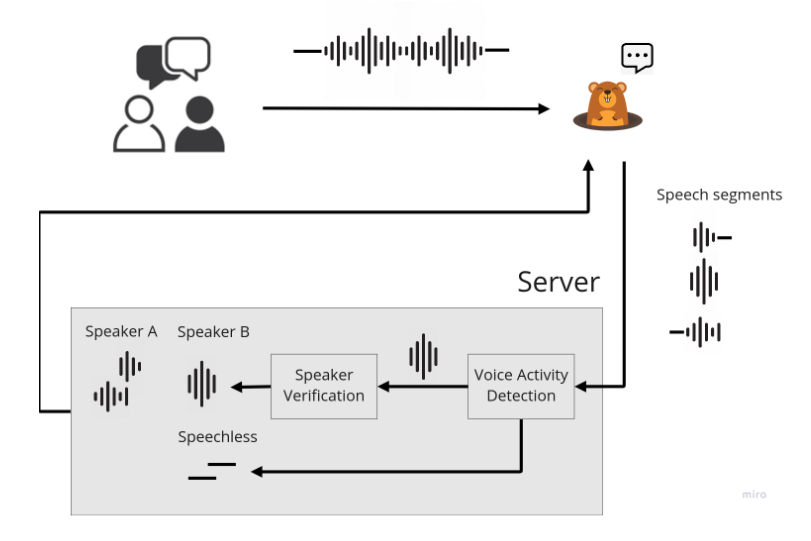

# Diglett
The backend server for the [Make Peace Project](https://medium.com/@8igmac/design-thinking-from-zero-to-hero-c3dec4ce5d25).

Features
- Speaker verification powered by [SpeechBrain](https://speechbrain.github.io/).
- Sound level meter.
- Real-time audio streaming using websocket.



## Usage
```sh
$ docker build -t diglett .
$ docker run -d --restart unless-stopped --name diglett -p 3210:80 diglett:latest
```

## Development
- Install dependency `portaudio19`
```
$ sudo apt-get -y portaudio19-dev
```
- Install [poetry](https://python-poetry.org/docs/#installation) for Python package management.
- Create your own `.env` to store sensitive information. (You can copy `example.env`
and modify the content as you needed.) 
```sh
$ cp example.env .env
# Edit .env
```
- Run the development server.
```sh
$ uvicorn server:app --reload
```
- Run the test.
```sh
$ python -m pytest
```

## Acknowledgements
Make Peace project was done by me and my teamates: 林敬庭、邵映慈、陳柏均