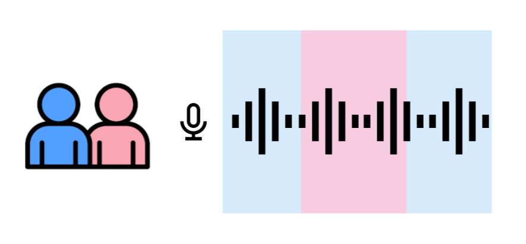
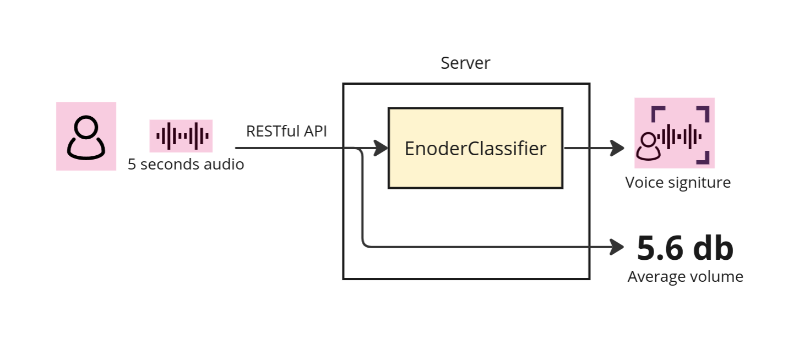
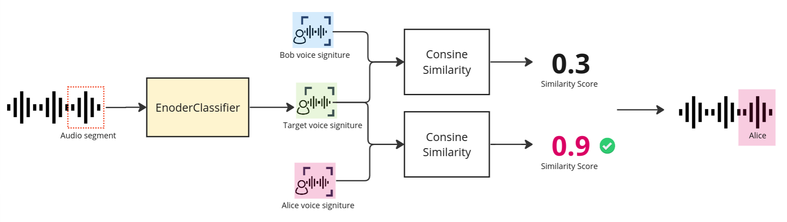

# Diglett


Diglett offers real-time speaker verification capabilities tailored for long conversations on the web.



<!-- TODO: demo (screenshot, video, demo link) -->

1. **Get speaker embedding**: Each user record a 5 seconds 
audio sample and send the audio to the server through a RESTful 
API to get a speaker embedding for each user.
2. **Start streaming audio and get speaker verification result**:
Open the websocket connection to the server and start streaming the
conversation. The server will return the speaker verification 
result in **real-time**. 

## Features
- **Real-time Speaker verification**: Powered by FastAPI and 
websocket. Support up to 2 people in a conversation.
- **Voice activity detection (VAD)**: Capable of identify segment 
of audio stream where no one is speaking.
- **Sound level detection**: Detect loudness in real-time.
- **Stateless**: Can scale up and down in cloud environment effortlessly.

## How does it works?

### Phase 1: Get Voice Signiture

1. **Upload 5 seconds audio sample**: Each user upload a 5 seconds recording of their voice as well
as their name to the server through a RESTful API. 
2. **Generate voice signiture**: Upon receiving the 5 seconds audio, the server will encode 
the audio with a 
[EncoderClassifier](https://speechbrain.readthedocs.io/en/latest/API/speechbrain.inference.classifiers.html#speechbrain.inference.classifiers.EncoderClassifier) and get a speaker embeddings as the voice signiture (Will later be used to identify the speaker)
3. **Calculate the average volume**: The server will also calculate the mean energy level as the average
speaker volume.
4. **Return voice signiture and average volume**: Finally, the server will send back a HTTP response which contains
the speaker's name, the speaker's voice embeddings, and the 
speaker's average volume.

### Phase 2: Real-time Speaker Verification

1. **Client stream the conversation**: The client start record the conversation, at the same time, send each segment of the conversation as well as 2 speaker's
embedding to the server in the background through a websocket connection.
3. **Get the target signiture**: Upon receiving every segment of audio conversation and 2 speaker's
embeddings, the server will encode the target audio segment
with EncoderClassifier and get a target embedding.
4. **Find out the most similar speaker**: Compare the similarity score (with Cosine similarity) between
the target embedding and 2 speaker's embeddings to find out 
the most similar one. If the similarity score for both speaker's
embedding is below a certain threshold, than we identify this 
audio segment as sound from a third party (either a third person, 
or both people speaking at the same time, or a silence).
5. **Find out the average volume**: The server will also calculate the average volume of the audio
segment.
6. **Send back the result**: The server will stream back the speaker verification result as
well as the average volume of the audio segment.

<!-- TODO: API documentation and example. -->
## API Documentation
- Get speaker embedding (RESTful API).
  - input
  - output

- Speaker verification streaming (websocket).
  - input
    ```
    ws://{SERVER_IP}:{PORT}/ws/stream
    ```

<!-- Deploy using Docker. -->
## Deploy with Docker
- Build Docker image with the Dockerfile.
```
$ docker buildx build -t diglett .
```
- Run Docker container.
```
$ docker run -d --restart unless-stopped --name diglett -p 3210:80 diglett:latest
```

## Setup local development environment
- Install dependency `portaudio19`
```
$ sudo apt-get -y portaudio19-dev
```
- Install [poetry](https://python-poetry.org/docs/#installation) for Python package management.
```
$ pipx install poetry
```
- Clone the repo and install dependencies with poetry.
```
# Clone and cd into the repo.
$ poetry install
```
- Create your own `.env` to store sensitive information. (You can copy `example.env`
and modify the content as you needed.) 
```sh
$ cp example.env .env
# Edit .env
```
- Run the development server.
```sh
$ uvicorn diglett.main:app --reload
```
- Now you can do:
  - Run example Python client.
  ```
  $ python example/client.py 
  ```
  - Get the speaker embedding with `curl`.
  ```
  $ curl -X POST -F "file=@/path/to/file.wav" SERVER_IP:PORT/embed
  ```
  - Run the test.
  ```sh
  $ python -m pytest
  ```